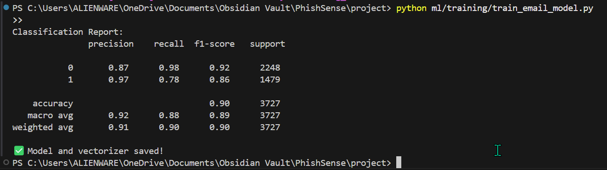
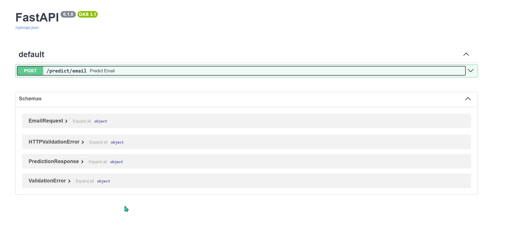
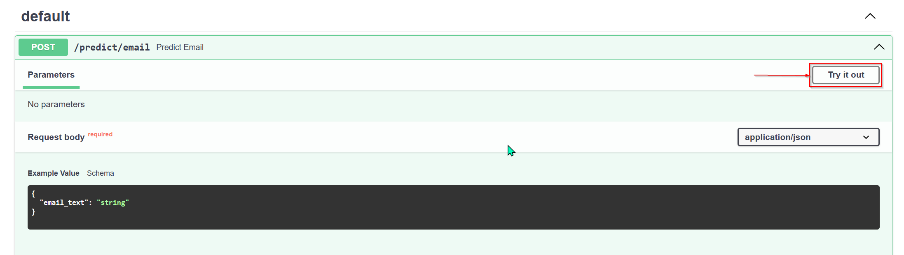
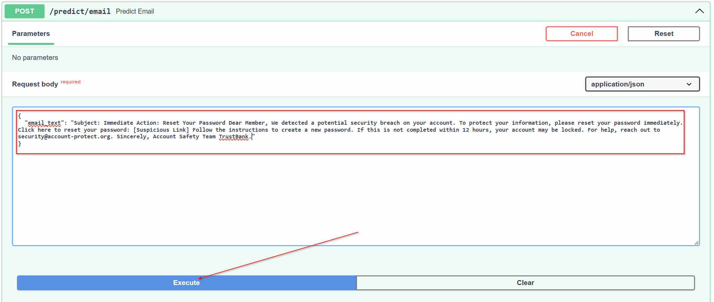
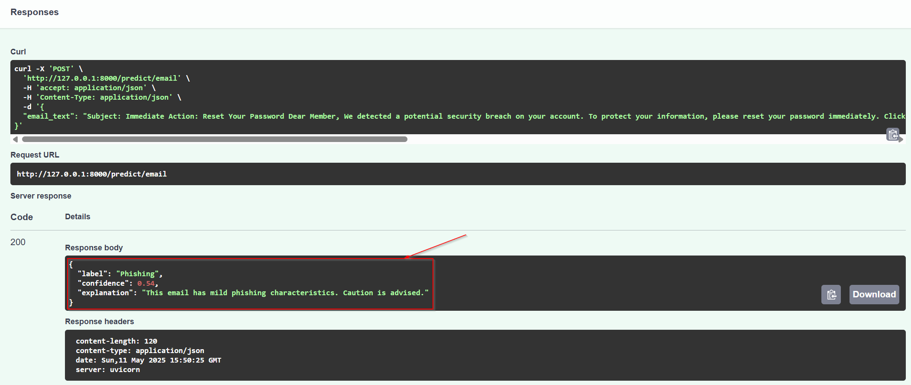
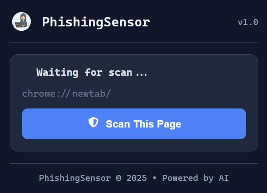
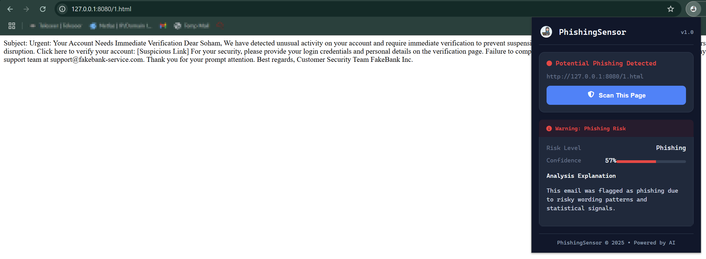

# PhishingSensor: A Tale of AI, Suspicion, and Browser Bravery

Welcome to **PhishingSensor**, where a humble idea turned into a browser’s personal bodyguard. This is the story of how we trained an AI, built a real-time scanner, and wrapped it all in a futuristic extension. If you’re here to know *how it works* and *what we built*, read on.

---

## 🪜 Step 1: Training the AI Brain

We started with a dataset of phishing and legitimate emails. Not URLs, not fake login pages — just the written word. The goal: teach our model to recognize the language of deception.

- **Model:** Multinomial Naive Bayes
- **Features:** TF-IDF (because word frequency matters)
- **Tooling:** Python, Scikit-learn
- **Accuracy:** ~90% on validation data




Once trained, we saved:
```
📁 saved_models/
├── email_model.joblib       # The trained model
└── vectorizer.joblib        # The TF-IDF transformer
```

This model is the decision-maker behind our scanner.

---

## 🧠 Step 2: Giving It a Voice — The FastAPI Backend

An AI model sitting in a `.joblib` file doesn’t do much. So we built a **FastAPI backend**:

- Endpoint: `POST /predict/email`
- Input: Raw email/page text
- Output: Label (Safe or Phishing), Confidence score, and a dynamic explanation






We even made the backend smart enough to say things like:
> “This email strongly resembles known phishing patterns with high-risk vocabulary.”

That’s right — our AI explains itself.

---

## 🔧 Step 3: Building the Chrome Extension

Next, we wrapped it in something usable — a **Chrome extension** that lets users scan the current webpage with one click.

- Reads the visible page text using `chrome.scripting.executeScript`
- Sends it to our backend for analysis
- Shows the result: a risk level, confidence bar, and an explanation
- Saves previous scans with `chrome.storage.local`

---

## 🖼️ Step 4: Adding Polish

Once it worked, we made it look good:

- Stylish UI with custom CSS



- Status indicators: Safe, Suspicious, or Phishing
- Confidence meter (as a progress bar)



---

## 💡 What You Can Try Today

- Load the extension from the `/public/` folder in Chrome
- Start the FastAPI backend:
  
  ```bash
  uvicorn backend.app.main:app --reload
  ```
  
- Click “Scan This Page” on any site (just not `chrome://` pages — Chrome doesn’t allow that)
- Get an instant, AI-powered risk report

---

## 🧪 What’s Working
- Extension UI: ✅
- Email model & prediction: ✅
- Real-time scan & response: ✅
- FastAPI Swagger UI: ✅

---

## 🛠️ What’s Coming Soon
- URL + HTML model integration
- Feedback collection and online learning
- Full-featured React dashboard (it’s scaffolded but sleepy)
- Public deployment of the backend

---

## 🤝 Why This Exists

Phishing is subtle. Scammers use psychology, not just shady URLs. This tool aims to detect those tricks **before you click**, using AI that understands the language of manipulation.

It’s not perfect — yet — but it’s learning fast.

---

Made with <3 and a mild distrust of emails that say "URGENT: Verify your account now."

Over n Out.
